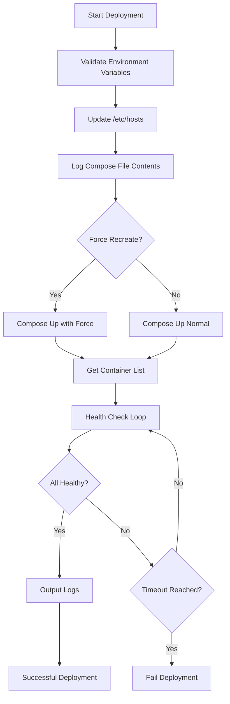

# Docker Deployment Automation Tool

> **Secure & Reliable Container Deployment**  
> Extension of [docker-remote](https://hub.docker.com/repository/docker/eliasmeireles/docker-remote/general)

This solution provides automated, production-grade Docker container deployment with comprehensive health monitoring and
logging. It's designed for secure operations in remote Docker environments with full visibility into the deployment
process.

## Key Features

- 🔒 Secure remote Docker server connectivity
- 📋 Docker Compose file validation and logging
- 🩺 Comprehensive container health checks
- ⏱️ Configurable timeout thresholds
- 📜 Container log aggregation with clear labeling
- ♻️ Force recreation capability when needed
- 🚦 Robust error handling and status reporting

## Prerequisites

- Docker Engine 20.10+
- Docker Compose v2.0+
- TLS certificates properly configured for remote Docker access
- Network access to Docker remote server (port 2376 typically)

## 🚨 Critical Deployment Alert

**Important Risk Notice:**  
This deployment strategy follows a *replace-in-place* pattern. If the deployment fails after stopping existing containers but before successfully starting new ones:

1. The previous containers **will not be automatically restored**
2. Services may remain unavailable until manual intervention
3. Always have a rollback plan prepared

**Mitigation Strategies:**
- Implement blue-green deployment patterns for critical services
- Maintain recent backups of working configurations
- Consider using Docker's rollback features with named volumes

## Container Naming Recommendations

For reliable deployment management, **always explicitly name your services** in both the Docker Compose file and container configurations:

```yaml
services:
   web-app:
      container_name: web-app-prod  # Explicit container naming
      image: my-registry/web-app:1.2.3
      restart: unless-stopped

   database:
      container_name: db-primary
      image: postgres:14.1
```

## Security Considerations

Before deployment, ensure:

1. Your Docker remote connection uses TLS encryption
2. Certificates are properly mounted in `/etc/docker/certs.d`
3. The remote Docker API is not publicly exposed without authentication
4. All images come from trusted registries

## Deployment Guide

### Environment Variables Configuration

| Variable                   | Description                                       | Required | Default                                | Example Value              |
|----------------------------|---------------------------------------------------|----------|----------------------------------------|----------------------------|
| `DOCKER_REMOTE_IP_ADDRESS` | IP address of the Docker remote server            | Yes      | -                                      | `192.168.1.100`            |
| `DOCKER_REGISTRY_HOST`     | Docker registry hostname                          | Yes      | -                                      | `my-registry.example.com`  |
| `DOCKER_COMPOSE_FILE`      | Absolute path to Docker Compose file in container | Yes      | -                                      | `/opt/docker-compose.yml`  |
| `DOCKER_REMOTE_HOSTNAME`   | Hostname of Docker remote server                  | Yes      | -                                      | `docker-prod-01`           |
| `DOCKER_HOST`              | Docker daemon connection string                   | No       | `tcp://${DOCKER_REMOTE_HOSTNAME}:2376` | `tcp://docker-remote:2376` |
| `TIMEOUT`                  | Health check timeout in seconds                   | No       | `300`                                  | `600`                      |
| `FORCE`                    | Force container recreation (`true`/`false`)       | No       | `false`                                | `true`                     |

### Execution Command

```bash
docker run --rm --name docker-deployment \
  -e DOCKER_REMOTE_IP_ADDRESS="172.16.0.10" \
  -e DOCKER_REGISTRY_HOST="registry.example.com" \
  -e DOCKER_COMPOSE_FILE=/opt/docker-compose.yml \
  -e DOCKER_REMOTE_HOSTNAME="docker-prod" \
  -e TIMEOUT="600" \
  -e FORCE="true" \
  -v "${HOME}/docker/certs.d:/etc/docker/certs.d" \
  -v "./deployment/docker-compose.yml:/opt/docker-compose.yml" \
  eliasmeireles/docker-deployment:latest
```

### Visual Deployment Flow



## Monitoring & Troubleshooting

### Expected Log Output


### Common Issues Resolution

1. **Connection Failures**:
   - Verify certificates are properly mounted
   - Check network connectivity to remote host
   - Validate Docker daemon is listening on correct port

2. **Health Check Timeouts**:
   - Increase TIMEOUT value for slow-starting containers
   - Verify container healthcheck definitions
   - Check resource availability on target host

3. **Image Pull Errors**:
   - Confirm registry authentication
   - Verify image tags exist in registry
   - Check network access to registry

## Advanced Configuration

### Custom Health Check Endpoints

For services requiring custom health checks, add to your compose file:

```yaml
services:
   my-app:
      healthcheck:
         test: [ "CMD", "curl", "-f", "http://localhost:8080/health" ]
         interval: 30s
         timeout: 10s
         retries: 3
         start_period: 5s
```

### Deployment Verification

After deployment completes:

1. All containers should show as "healthy" or "running"
2. Logs should show expected startup patterns
3. Services should respond to requests

## Best Practices

1. **Always** use version-pinned images in production (`image: my-app:1.2.3`)
2. **Regularly** rotate your Docker TLS certificates
3. **Monitor** container resource usage after deployment
4. **Test** deployments in staging before production
5. **Review** logs for any unexpected warnings or errors

## Monitoring Recommendations

Post-deployment, immediately verify:

1. Container status with `docker ps -a`
2. Resource usage with `docker stats`
3. Service endpoints with health checks
4. Log outputs for errors

## Support

For issues not covered in this documentation,
please [open an issue](https://github.com/eliasmeireles/docker-deployment/issues) on GitHub.

---

