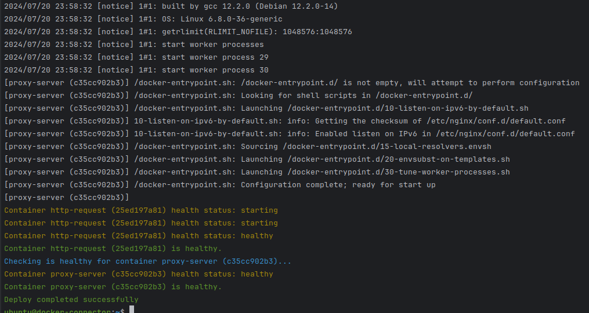

# Docker Deployment Script

This script automates the deployment of Docker containers using a Docker Compose file. It supports environment variables
for configuration, updates the `/etc/hosts` file with a Docker server IP, logs the contents of the Docker Compose file,
and performs health checks on the deployed containers.

## Prerequisites

- Docker
- Docker Compose

## Usage

To use this script, set the required environment variables and run the script using Go.

## TLS configuration Requirements

> Ensure that the Docker server is configured to use TLS with the following certificates, and you have access to the
> ca.pem, cert.pem, key.pem and ca-key.pem files do bind with the docker.

- Required as a volume to the container, the path to the TLS certificates directory.

> `-v path/tls/files:/etc/docker/certs.d`

- example:

```sh
docker run --rm -it --name docker-deployment \
        -e DOCKER_SERVER_IP=10.85.62.58 \
        -e DOCKER_COMPOSE_FILE=/opt/docker-compose.yml \
        -e TIMEOUT=30 \
        -e FORCE=true \
        -v path/tls/files:/etc/docker/certs.d \
        -v ./docker-compose.yml:/opt/docker-compose.yml \
        eliasmeireles/docker-deployment
```

- Log output



You can also try the [example](example/README.md).

### Docker Remote Configuration

There is shell script that can help you to configure the docker remote server.

- Be careful where to run this script.

```shell
./docker-remote
```

### Environment Variables

| Environment Variable  | Description                                                           | Required | Default Value   |
|-----------------------|-----------------------------------------------------------------------|----------|-----------------|
| `DOCKER_COMPOSE_FILE` | Path to the Docker Compose file.                                      | Yes      | N/A             |
| `TIMEOUT`             | Timeout duration for health checks (in seconds).                      | No       | `60` (1 minute) |
| `DOCKER_SERVER_IP`    | IP address of the Docker server. If provide, add it to the /etc/hosts | No       | N/A             |
| `FORCE`               | If set, forces container recreation.                                  | No       | `false`         |

### Running the Script

1. Set the environment variables:

```sh
export DOCKER_COMPOSE_FILE=/path/to/docker-compose.yml
export TIMEOUT=120
export DOCKER_SERVER_IP=192.168.1.100
export FORCE=true
```

2. Run the Go script:

```sh
go run main.go
```

## Script Workflow

1. **Environment Variable Check**: The script checks if the required environment variables are set. If any required
   variable is missing, it exits with an error message.
2. **Update /etc/hosts**: The script updates the `/etc/hosts` file to include an entry for the Docker server.
3. **Log Docker Compose Content**: It logs the contents of the Docker Compose file for reference.
4. **Run Docker Compose**: The script runs `docker-compose up -d` with an optional `--force-recreate` flag based on
   the `FORCE` environment variable.
5. **Retrieve Containers**: It retrieves the list of containers started by the Docker Compose file.
6. **Health Checks**: The script performs health checks on the containers. If a container has a health check defined, it
   validates the health status. Otherwise, it checks if the container is running.
7. **Retrieve Logs**: The script retrieves and prints the logs of each container, prefixing each log line with the
   container name and a shortened container ID.

## Health Checks

The script continuously checks the health status of the containers until they are either healthy or running. If a
container becomes unhealthy or if the timeout is reached, the script exits with an error.

## Logs

The logs of each container are retrieved and printed with each line prefixed by the container name and a shortened
container ID.

## Error Handling

The script handles errors at each step and exits with an appropriate error message if any step fails.

## Example

Here's an example of setting the environment variables and running the script:

```sh
export DOCKER_COMPOSE_FILE=./docker-compose.yml
export TIMEOUT=60
export DOCKER_SERVER_IP=192.168.99.100
export FORCE=true

go run main.go
```
